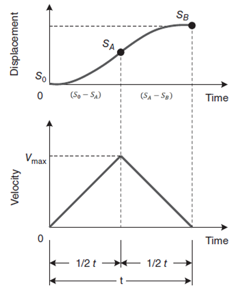
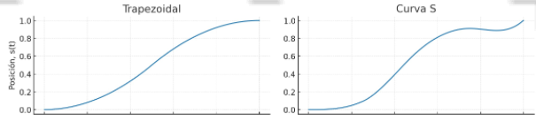
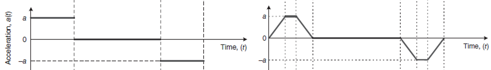
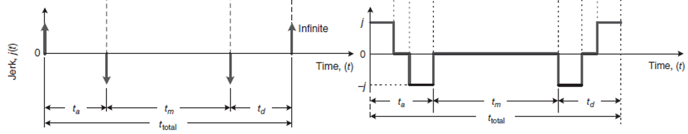

27 / 04 / 2025
# Perfil de Movimiento - Parte 2 

Con el objetivo de recordar lo visto en la clase pasada, se propone el siguiente ejemplo.
## 💡Ejemplo 1:

- Dado el perfil de velocidad simétrico de la figura 1, calcule la máxima velocidad y la aceleración máxima.

Figura 1. Perfil de velocidad simétrico 

Solución:

$$S_{B} = {\color{Red}\frac{1}{2}v_{max}\frac{t}{2}} + {\color{Green}\frac{1}{2}v_{max}\frac{t}{2}}$$

Se consideran ambas partes de la curva: la ecuación en rojo corresponde al segmento A, mientras que la ecuación en verde representa el segmento B.

$$S_{B} = \frac{1}{2}v_{max}t$$

En la gráfica de velocidad el tiempo de movimiento es igual a 0.

$$v_{max} = \frac{2_{S_{B}}}{t}$$

$$a = \frac{2v_{max}}{t}$$

# Perfil de velocidad curva en S
La curva en S se utiliza en perfiles de movimiento para suavizar la transición entre las distintas fafes de desplazamiento, reduciendo así las vibraciones mecánicas y los esfuerzos sobre los componentes del sistema. A diferencia de los perfiles lineales, en los que los camibos de aceleración ocurren de forma repentina, la curva en S introduce una transición gradual que mejora significativamente el comportamiento dinámico del sistema.

- Perfil de Posición:
  - En ambos casos, al integrar el perfil de velocidad se obtiene una función de tercer orden para la posición. Sin embargo, en el perfil con curva en S, el crecimiento de a posición es más progresivo y continuo, sin cambios bruscos de pendiente. Esto se traduce en un desplazamiento más fluido y preciso.

Figura 1. Perfil de Posición

- Perfil de Aceleración:
  - Perfil Lineal: La aceleración se presenta en forma de escalones o saltos repentinos. En cada etapa del movimientp (aceleración constante, velocidad constante, desaceleración), la aceleración cambia bruscamente de valor, lo que puede generar impactos al sistema.
    
Figura 1. Perfil de Posición

  - Perfil Curva en S: La aceleración es continua y suave. Está compuesta por tres fases: Pendiente positiva (incrementa la aceleración), constante, y una pendiente negativa (disminuye la aceleración). Este comportamiento se representa mediante funciones cuadráticas (segund orden), lo que hace que al derivar para obtener el Jeck sea lineal
     
Figura 1. Perfil de Posición

- Perfil de Jeck: 
  - Perfil Lineal: Se aprecian saltos abruptos,, ya que la aceleración cambia de forma instantánea.
  - Perfil Curva en S: Se observa una transición continua con cambios suaves. 

Con
Se suavisa el perfil aceleración.
Protección a los actuadores y mecanismos. Ya que al tener una aceleración más sueva el Jerk es mucho más suave, evitando movimientos bruscos. Cabe mencionar que el perfil a usar depende del movimiento a realizar.

