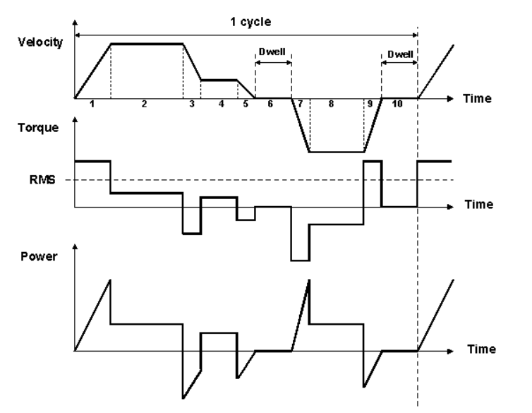

# 
27 / 04 / 2025
# Perfil de Movimiento - Parte 2 

Con el objetivo de recordar lo visto en la clase pasada, se propone el siguiente ejemplo.
## 💡Ejemplo 1:

- Dado el perfil de velocidad simétrico de la figura 1, calcule la máxima velocidad y la aceleración máxima.

Figura 1. Perfil de velocidad simétrico 

Solución:

$$S_{B} = {\color{Red}\frac{1}{2}v_{max}\frac{t}{2}} + {\color{Green}\frac{1}{2}v_{max}\frac{t}{2}}$$

Se consideran ambas partes de la curva: la ecuación en rojo corresponde al segmento A, mientras que la ecuación en verde representa el segmento B.

$$S_{B} = \frac{1}{2}v_{max}t$$

En la gráfica de velocidad el tiempo de movimiento es igual a 0.

$$v_{max} = \frac{2_{S_{B}}}{t}$$

$$a = \frac{2v_{max}}{t}$$

# Perfil curva en S
La curva en S se utiliza en los perfiles de movimiento para suavizar la transición entre las distintas fases de desplazamiento, reduciendo así las vibraciones mecánicas y los esfuerzos sobre los componentes del sistema. A diferencia de los perfiles lineales, donde los cambios de aceleración ocurren de manera abrupta, la curva en S introduce una transición progresiva que mejora significativamente el comportamiento dinámico del sistema.

Este tipo de perfil permite un cambio gradual en la aceleración, lo cual contribuye a minimizar o eliminar problemas como el rebasamiento. Como resultado, el sistema experimenta una notable reducción en las vibraciones mecánicas. Los puntos de aceleración mínima se encuentran al inicio y al final del período de aceleración, mientras que la aceleración máxima se alcanza en el punto medio. De esta manera, se obtiene un perfil de movimiento mucho más suave y eficiente.

Figura 2. Perfil curva en S

- Perfil de Posición:
  - En ambos casos, al integrar el perfil de velocidad se obtiene una función de tercer orden para la posición. En el perfil con curva en S, el crecimiento de la posición es más progresivo y continuo, sin cambios bruscos en la pendiente. Esto se traduce en un desplazamiento más fluido y preciso. El perfil de posición en una curva en S se describe cómo varía la ubicación del sistema a lo largo del tiempo, desde un punto inicial hasta uno final. A diferencia de perfiles más simples, como el trapezoidal, la curva en S proporciona una trayectoria suave y continua, evitando transiciones abruptas que podrían generar vibraciones o pérdida de precisión.

  
    
Figura 3. Perfil de Posición

- Perfil de Aceleración:
  - Se describe cómo la velocidad del sistema cambia con el tiempo. En una curva en S, la aceleración comienza desde cero, aumenta de manera progresiva hasta alcanzar un valor máximo y luego disminuye suavemente hasta llegar nuevamente a cero. Este comportamiento ayuda a evitar los picos de aceleración que pueden causar estrés o daños en los componentes mecánicos. La aceleración controlada es crucial para mantener la estabilidad dinámica y mejorar el rendimiento general del sistema de movimiento.
    
    - Perfil Lineal: La aceleración se presenta en forma de escalones o saltos repentinos. En cada etapa del movimientp (aceleración constante, velocidad constante, desaceleración), la aceleración cambia bruscamente de valor, lo que puede generar impactos al sistema.

    - Perfil Curva en S: La aceleración es continua y suave. Está compuesta por tres fases: Pendiente positiva (incrementa la aceleración), constante, y una pendiente negativa (disminuye la aceleración). Este comportamiento se representa mediante funciones cuadráticas (segund orden), lo que hace que al derivar para obtener el Jeck sea lineal.
  
    
Figura 4. Perfil de Aceleración

- Perfil de Jeck:

  - El jerk es la tasa de cambio de la aceleración, o la derivada de la aceleración con respecto al tiempo. En los perfiles de curva en S, el jerk se mantiene continuo y limitado, lo que implica que los cambios en la aceleración son suaves y no generan fluctuaciones bruscas. Controlar el jerk es fundamental para evitar vibraciones indeseadas o daños mecánicos en los componentes, ya que los cambios rápidos de aceleración pueden generar picos de fuerza que afectan negativamente la precisión y la durabilidad del sistema. Un jerk controlado garantiza que el movimiento sea aún más suave y preciso
    - Perfil Lineal: Se aprecian saltos abruptos, ya que la aceleración cambia de forma instantánea.
    - Perfil Curva en S: Se observa una transición continua con cambios suaves.
    
     
Figura 5. Perfil de Jeck

Se encuentra 2 clases de curvas en S:
1. Perfiles S pura: 2 modelos de segundo orden conectados entre ellos; este perfil es mucho más suave.
2. Perfiles en S: Si 2 modelos de segundo orden y un modelo de primer orden en la mitad.

# Modelo matemático

Cada segmento curvo del perfil de velocidad respecto al tiempo (t) se modela mediante un polinomio de segundo orden, el cual permite una transición gradual entre diferentes niveles de velocidad. La expresión matemática del perfil de velocidad es:

$$v(t) = C_{1}(t)^2 + C_{2}(t) + C_{3}$$

$$C_{1}, C_{2} y C_{3}$$ son coeficientes determinados a partir de las condiciones de frontera, es decir, las condiciones iniciales y finales del movimiento (como la velocidad, aceleración o posición en instantes específicos).

Este tipo de polinomio permite definir un perfil de aceleración continua, lo cual es fundamental para evitar esfuerzos mecánicos excesivos y para mejorar la eficiencia energética del sistema.

El perfil curva S se caracteriza por tener una aceleración que varía de manera continua, iniciando desde cero, alcanzando un valor máximo, y luego regresando nuevamente a cero, lo cual evita los cambios abruptos que se presentan en perfiles trapezoidales.

A continuación se evalúan las condiciones de frontera 

## 💡Ejemplo  2

Curva A:
En el tiempo igual a 0 (cero), la velocidad vale 0 y al derivar la velocidad para hallar la aceleración se determina que también es 0.
El tiempo final es t/2, por ende, debe llevar la mitad de la velocidad.

Fronteras

$$0 < t < \frac{t_{a}}{2}$$

Límites iniciales 

$$v(0) = 0$$
$$a(0) = \frac{dv}{dt} = 0$$

Límites finales

$$v(\frac{t_{a}}{2}) = \frac{v_{m}}{2}$$
$$a(\frac{t_{a}}{2}) = a$$

Se evalúa el polinomio para hallar C1, C2 y C3

$$v(0) = C_{1}(0)^2 + C_{2}(0) + C_{3} = 0$$
$$ C_{3} = 0$$

$$v(\frac{t_{a}}{2}) = \frac{C_{1}t_{a}^2}{4} = \frac{v_{m}}{2}$$
$$C1 = \frac{2v_{m}}{t_{a}^2}$$
$$v(t) = \frac{2vm}{t_{a}^2}t^2$$

Ahora se escriben las ecuaciones para hallar los valores de los coeficientes:

$$v(t) = C_{1}(t)^2 + C_{2}(t) + C_{3}$$
$$a(t) = 2C_{1}(t) + C_{2}$$

1. $$a(t_{a}) = 2C_{1}(t_{a}) + C_{2} = 0$$
2. $$a(\frac{t_{a}}{2}) = C_{1}(t_{a}) + C_{2} = a$$
 
 Despeje de los coeficientes:

- Coeficiente $$C_{1}$$:
  
$$C_{1}t_{a} + a - C_{1}t_{a} = 0$$

$$C_{1}(2t_{a} - t_{a}) = -a$$

$${\color{Red}C_{1} = \frac{-a}{t_{a}}}$$

- Coeficiente $$C_{2}$$:
  
$$\frac{a}{\color{Green} {t_{a}}}{\color{Green} {t_{a}}} + C_{a} = a $$
  
$${\color{Red}C_{2} = 2a}$$

- Coeficiente $$C_{3}$$:

$$\frac{-a}{t_{a}}(t_{a})^2 + 2at_{a} + C_{3} = v_{m}$$

$$-at_{a} + 2at_{a} + C_{3} = v_{m}$$

$$C_{3} = v_{m} + at_{a} - 2at_{a}$$

$${\color{Red}C_{3} = v_{m} - at_{a}}$$

Ahora se resuelve teniendo en cuenta los coeficientes:

$$v_A(t) = \frac{2v_m}{t_a^2} t^2 \quad\quad 
v_B(t) = v_m - \frac{2v_m}{t_a^2}(t_a - t)^2$$

$$s(t) = \int_{0}^{15} \frac{2 \cdot 32}{30^2} t^2 \, dt + \int_{15}^{30} 32 - \frac{2 \cdot 32}{30^2}(30 - t)^2 \, dt$$

$$s(t) = \int_{0}^{15} \frac{64}{900} t^2 \, dt + \int_{15}^{30} 32 - \frac{64}{900}(30^2 - 60t + t^2) \, dt$$

Obtener la posición (axis) transcurridos 100 ms a partir del perfil de velocidad:

$$s_OB(t) = [0.023 * t^3]from t=0 to t=15 + [32 * t + 0.071 * (900 * t - (60 / 2) * t^2 + (t^3) / 3)] from t=15 to t=30$$

$$s_{OB}(t) = 77.62 + 480 - 64.12 = 493.49 \text{ cts}$$

$$s_{OC}(t) = 493.49 + 32 \cdot 70 = 2733.49 \text{ cts}$$

# Movimiento Multieje

Los sistemas que requieren el control simultáneo de múltiples ejes como manipuladores, los cuales utilizan perfiles de movimiento multi-eje. Este tipo de perfiles se basan en la coordinación precisa entre dos o más ejes (axis) para lograr un trayecto o acción específica de forma sincronizada.  En estos sistemas, varios motores o actuadores trabajan juntos para mover un objeto o herramienta en varias direcciones simultáneamente, logrando trayectorias complejas y precisas.

Se debe tener en cuenta los siguientes movimientos:

### Movimiento Secuencial:
- El movimiento secuencial es ideal para aplicaciones que requieren un proceso ordenado y controlado de manera sencilla, sin necesidad de gestionar múltiples ejes en movimiento simultáneo. Esto lo hace más accesible y eficiente para tareas que no demandan alta complejidad dinámica.
- En este enfoque, el movimiento de los ejes se realiza de forma sucesiva, comenzando con un eje y luego pasando al siguiente. Aunque esta metodología es simple, puede resultar más lenta en situaciones donde se requiere una precisión conjunta entre varios ejes.

### Movimiento Simultáneo:
- El movimiento simultáneo se refiere al control y movimiento de múltiples ejes al mismo tiempo, coordinando su desplazamiento en una sola operación. A diferencia del movimiento secuencial, donde los ejes se mueven de manera individual y sucesiva, en el movimiento simultáneo, todos los ejes trabajan en conjunto, ejecutando su desplazamiento de manera sincronizada para lograr trayectorias complejas y precisas.

### Movimiento Interpolado:
- El movimiento interpolado es un tipo de control que permite generar trayectorias complejas y suaves mediante la combinación continua del movimiento de varios ejes. A diferencia de los movimientos secuenciales o simultáneos, la interpolación busca garantizar un desplazamiento fluido y preciso entre puntos o trayectorias.
- En este tipo de movimiento, ambos ejes son controlados para iniciar y finalizar su desplazamiento exactamente al mismo tiempo, manteniendo una trayectoria precisa, como una línea recta en el espacio cartesiano. Dependiendo de la trayectoria requerida, se puede utilizar interpolación lineal o circular, adaptándose a las necesidades específicas del movimiento.

## 💡Ejemplo 3

Considere la máquina de la figura. Si ambos ejes se mueven a una velocidad de 4 cm/s usando un perfil de velocidad trapezoidal con 𝑡𝑎 = 0,2 s, ¿Cuánto tiempo le tomará a cada eje completar el movimiento?

$$t_{a} = 0.2s,      L_{x} = 16cm,  v_{x} = 4 cm/s$$
$$L_{y} = 12cm,   v_{y} = 4 cm/s$$

$$tx_{m} = \frac{L_{x}}{v_{m}} - t_{a}$$

$$tx_{m} = \frac{16cm}{4 cm/s} - 0.2 = 3.8s$$

$$ {\color{Green} tx_{total} = 3.8 + 2t_{a} = 4.2s} $$

$$ty_{m} = \frac{L_{y}}{v_{m}} - t_{a}$$

$$ty_{m} = \frac{12cm}{4 cm/s} - 0.2 = 2.8s$$

$${\color{Green} ty_{total} = 2.8 + 2t_{a} = 3.2s} $$

## 💡Ejemplo 4
Para el ejemplo anterior, ahora se debería tomar como referencia el perfil de velocidad del eje (axis) que tomará mas tiempo e interpolar para el otro eje (axis), para que ambos terminen al mismo tiempo.

$$v_{x} = 4 cm/s,  t_{a} = 0.2s,   v_{y} = ?$$

$$t_{m} = \frac{L_{y}}{t_{m} + t_{a}} = \frac{12cm}{3.8 + 0.2} = 3 cm/s$$

$$ {\color{Green} v_{y} = 3 cm/s}$$

# 📚 Ejercicios

1. Considere la máquina de la figura. Si ambos ejes se mueven a una velocidad de 8 cm/s usando un perfil de velocidad trapezoidal con 𝑡𝑎 = 0,6 s, ¿Cuánto tiempo le tomará a cada eje completar el movimiento?

$$t_{a} = 0.6s,      L_{x} = 45cm,  v_{x} = 8 cm/s$$
$$L_{y} = 20cm,   v_{y} = 8 cm/s$$

$$tx_{m} = \frac{L_{x}}{v_{m}} - t_{a}$$

$$tx_{m} = \frac{45cm}{8 cm/s} - 0.6 = 5.025s$$

$$ {\color{Green} tx_{total} = 5.025 + 2t_{a} = 5.625s} $$

$$ty_{m} = \frac{L_{y}}{v_{m}} - t_{a}$$

$$ty_{m} = \frac{20cm}{8 cm/s} - 0.6 = 1.9s$$

$${\color{Green} ty_{total} = 1.9 + 2t_{a} = 2.5s} $$

2. A partir del perfil de velocidad mostrado, obtenga la posición recorrida por el eje (axis) transcurridos 120 ms. Los datos conocidos son: Tiempo total: 120 ms, velocidad máxima 40 cm/s y tiempo de aceleración de 60ms.

Fase A (Aceleración)
Frontera:
$$0 \le t \le t_{a}$$

$$v_{a}(t) = \frac{2v_{m}}{t_{a}^2}t^2$$

$$s_{a}t = \int_{0}^{t_{a}}t_{a}^2dt = \frac{2v_{m}}{t_{a}^2} * \frac{t_{a}^3}{3} = \frac{2v_{m}t_{a}}{3}$$

Fase B - Desaceleración

$$v_{b}(t) = v_{m} - \frac{2v_{m}}{t_{a}^2}(t - t_{a})^2$$

Para: $$t_{a} \le t \le 2t_{a}$$

$$s_{b}t = \int_{2t_{a}}^{t_{a}^2} \left[ v_{m} -  \frac{2v_{m}}{t_{a}^2}(t - t_{a})^2 \right]dt = \frac{2v_{m}t_{a}}{3}$$

$$v_{m} = 40 cm/s$$
$$t_{a} = 0.06s$$

Fase A:

$$s_{a} = \frac{2 * 40 * 0.06}{3} = 1.6cm$$

Fase B:

$$s_{a} = \frac{2 * 40 * 0.06}{3} = 1.6cm$$

Respuesta:

$$s_{total} = 1.6 + 1.6 = 3.2cm$$

# Conclusiones
- La implementación de un perfil de movimiento con curva en S permite transiciones más suaves entre etapas, lo que reduce las vibraciones, mejora la precisión del posicionamiento y prolonga la vida útil de los componentes mecánicos. No obstante, su aplicación implica una mayor complejidad en los cálculos, lo que se traduce en un mayor consumo de recursos computacionales.

- El uso de perfiles de movimiento optimizados, como la curva en S, combinado con controladores de movimiento avanzados, mejora significativamente el comportamiento dinámico de los sistemas mecánicos. Al lograr una aceleración progresiva y controlar con precisión los parámetros eléctricos del motor, se minimizan las vibraciones y se optimiza el rendimiento general. Esta sinergia entre perfilado de movimiento y control inteligente resulta fundamental para alcanzar altos niveles de precisión, eficiencia y confiabilidad en aplicaciones industriales y robóticas.

- El perfil trapezoidal es más sencillo y eficiente en términos de cálculo, el perfil curva en S es superior cuando se busca optimizar el comportamiento dinámico del sistema, mejorar la precisión y aumentar la durabilidad de los componentes. La elección entre ambos perfiles dependerá de las necesidades específicas de la aplicación, como la complejidad del sistema, los requisitos de precisión y las limitaciones computacionales.

  
# Referencias
1. "Login aulas 2025”, Edu.co. [En línea]. Disponible en: https://aulas.ecci.edu.co/mod/resource/view.php?id=217529&forceview=1. [Consultado: 01-abr-2025].
2. J. Neugebauer, "Perfiles de control de movimiento: bueno, mejor y óptimo," DigiKey, 24-mar-2021. [En línea]. Disponible en: https://www.digikey.com/es/blog/motion-control-profiles-good-better-and-best [Accedido: 01-abr-2025].
